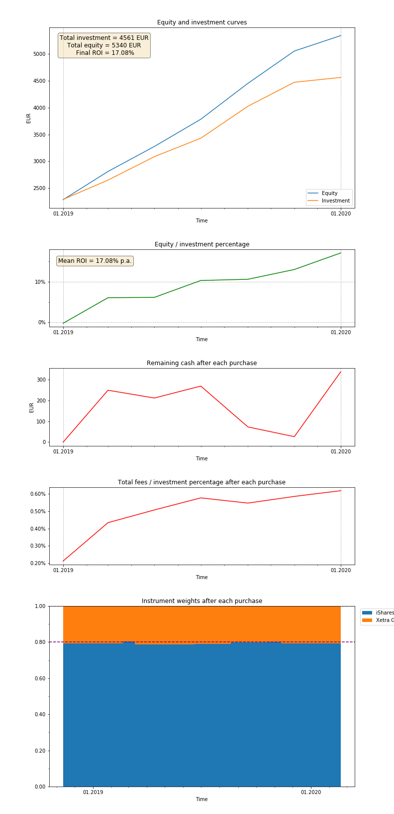

# simulatePortfolio

simulatePortfolio is a Python class that upon instantiation simulates performance of portfolio with **_stock instruments_**.

The main goal of this project is to provide basic metrics of **_long(er)-term investments_** based on the historical data and investment strategy.

___

## Features

- the simulator was developed for tracking **_long(er)-term investments_** with the time horizon of at least several months

- the simulator implements **_initial_** and **_monthly contributions_** and two kinds of instrument purchases:
  - **_initial purchase_**: of all instruments during the start date
  - **_regular purchases_**: of defined number of instruments at defined monthly intervals.
 
- the simulator acknowledges commission scheme typical for brokerage services:
  - **_absolute fee_**: absolute fee during purchase of one instrument
  - **_relative fee_**: fraction of purchased volume during purchase of one instrument
  - **_connection fee_**: absolute fee per calendar year
 
- it is necessary to define **_instrument weights_** in portfolio.\
The instrument weights are aimed to be preserved during simulation by solving of this SOE regularly:\
\
\cdot&space;\mathrm{price}_i}{\sum_{N}^{&space;}\left(\mathrm{noShares}_{j0}&space;&plus;&space;\mathrm{noShares}_j\right&space;)\cdot&space;\mathrm{price}_j},i=1,...,N)\
\
&space;\&space;&plus;&space;\&space;\mathrm{absFee}_j,&space;j&space;=&space;1,...,N)

- resulting stats are plotted when the simulation finish:
  - _equity and investment curves, return over investment_
  - _remaining cash after each purchase_
  - _total fees / investment percentage_
  - _instrument weights in portfolio after each purchase_

___

## Usage

```python
import datetime
from sp import simulatePortfolio

inst1 = {'name':'iShares S&P500', 'data':{datetime.date(2019, 1, 1): 259.05, datetime.date(2019, 2, 1): 276.162, datetime.date(2019, 3, 1): 282.065, datetime.date(2019, 4, 1): 291.348, datetime.date(2019, 5, 1): 287.017, datetime.date(2019, 6, 1): 286.0, datetime.date(2019, 7, 1): 299.4, datetime.date(2019, 8, 1): 294.882, datetime.date(2019, 9, 1): 296.533, datetime.date(2019, 10, 1): 299.253, datetime.date(2019, 11, 1): 311.615, datetime.date(2019, 12, 1): 318.435, datetime.date(2020, 1, 1): 326.11, datetime.date(2020, 2, 1): 325.68}}
inst2 = {'name':'Xetra Gold', 'data': {datetime.date(2019, 1, 1): 36.24, datetime.date(2019, 2, 1): 36.99, datetime.date(2019, 3, 1): 36.92, datetime.date(2019, 4, 1): 36.99, datetime.date(2019, 5, 1): 36.49, datetime.date(2019, 6, 1): 37.8, datetime.date(2019, 7, 1): 39.44, datetime.date(2019, 8, 1): 41.02, datetime.date(2019, 9, 1): 44.66, datetime.date(2019, 10, 1): 43.42, datetime.date(2019, 11, 1): 43.55, datetime.date(2019, 12, 1): 42.53, datetime.date(2020, 1, 1):44.03, datetime.date(2020, 2, 1):45.85}}

simulatePortfolio([[inst1, 0.8, 2.0, 0.00038],
                   [inst2, 0.2, 2.0, 0.00038]],
                  currency = 'EUR',
                  connectionFeePerYear = 2.5,
                  startDate = datetime.date(2019, 1, 1),
                  endDate = datetime.date(2020, 1, 1),
                  initCont = 2500,
                  monthCont = 200,
                  monthsPerTrade = 2,
                  instrumentsPerTrade = 2)
```

#### 1. Historical data

```python
instrA = {'name' : 'iShares SP500', 'data' : {datetime.date(2015, 1, 1): 158.93, datetime.date(2015, 2, 1): 160.48, datetime.date(2015, 3, 1): 163.74, datetime.date(2015, 4, 1): 167.06, datetime.date(2015, 5, 1): 166.15, datetime.date(2015, 6, 1): 163.35, datetime.date(2015, 7, 1): 163.69, datetime.date(2015, 8, 1): 161.68, datetime.date(2015, 9, 1): 162.54}}
instrB = {'name' : 'Xetra Gold', 'data' : {datetime.date(2015, 1, 20): 35.76, datetime.date(2015, 1, 21): 35.94, datetime.date(2015, 1, 22): 36.17, datetime.date(2015, 1, 23): 36.88, datetime.date(2015, 1, 26): 36.69, datetime.date(2015, 1, 27): 36.53, datetime.date(2015, 1, 28): 36.52, datetime.date(2015, 1, 29): 36.17, datetime.date(2015, 1, 30): 36.08}}
```

Historical data are nested `dict` with `name` and `data` keys.\
The actual data points consist of `datetime.date` objects coupled with instrument prices per share.
- It is possible to load **daily** or **monthly** prices
- Monthly prices should be coupled to the same day in month for all instruments (e.g. all prices are defined on the _1st day of month_)

#### 2. Portfolio

```python
[[iSharesSP500, 0.7, 2.0, 0.00038],
 [XetraGold, 0.3, 2.0, 0.00038]]
```

Portfolio is `list` of some instruments.\
Each instrument takes the form `[historical data, weight, absolute fee, relative fee]`

#### 3. Currency

```python
currency = 'EUR'
```

Currency symbol for informative purposes.

#### 4. Start, end date

```python
startDate = datetime.date(2015, 2, 3),
endDate = datetime.date(2019, 12, 30)
```

`datetime.date` objects defining simulation timespan.

#### 5. Connection fee

```python
connectionFeePerYear = 2.5
```

Absolute fee per calendar year.

#### 6. Initial and monhtly contributions

```python
initCont = 2500,
monthCont = 120
```

Contributed amount for initial and regular investments, respectively.

#### 7. Months per trade

```python
monthsPerTrade = 4
```

How many months should be between regular investments.

#### 8. Instruments per trade

```python
instrumentsPerTrade = 1
```

How many instruments should be traded during regular investments.

___

## Example

from the previous code:



___

## Known issues

- plots may be distrorted when plotted from terminal.\
  Use `jupyter notebook` or different `matplotlib` backend.
